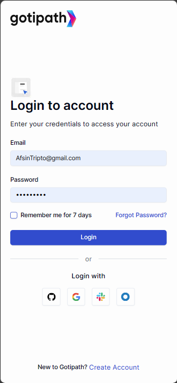
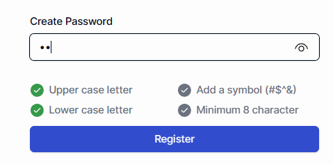

## Gotipath Simple Auth

This is a Next.js app router based project made for interacting a backend authentication service by Gotipath

## Technologies Used

1. 🧠 **Language: TypeScript**
1. ⚙️ **Framework: Next.js(App Router)**
1. 🎨 **Styling: Tailwind CSS, shadcn/ui**
1. 🟢 **Misc: Tanstack Query, React Hook Form, Zod, Axios, react-icons etc**

## Features

1. 📱 Fully responsive(both mobile and desktop)
   <br/>
   
1. 🔒 Authenticated routes can't be accessed without logging in
1. 💪 Robust form validation
1. 🔑 Password strength checker
   <br/>
   
1. 🔍 Optimized SEO and meta tags
   <br/>
   

## Project Structure

```dotnetcli
//This is the summarized folder structure

gotipath-assignment-1/
├── public/
├── src/
|    └── app/
|    └── components/
|    └── utils/
|    └── hooks/
|    └── constants/
|    └── providers/
|    └── lib/
```

```dotnetcli
//This is the route structure

gotipath-assignment-1/
├── app/
|    └── auth/
|          └── login/
|          └── register/
|          └── reset-password/
|    └── dashboard/(🔒)
|    └── 404

🔒 = "Authenticated Route"
```

## Usage

1. Clone this repository -

```dotnetcli
git clone https://github.com/TriptoAfsin/gotipath-assignment-1.git
```

2. Go into the project route folder and run this command -

```dotnetcli
npm i
```

3. Now create a `.env` file, the details have been given into the email

4. Run this command to start the dev server -

```dotnetcli
npm run dev
```

5. Run this command to build for production deployment -

```dotnetcli
npm run build
```

### 🚀 Live Link: [Gotipath](https://gotipath-triptex.vercel.app/)
